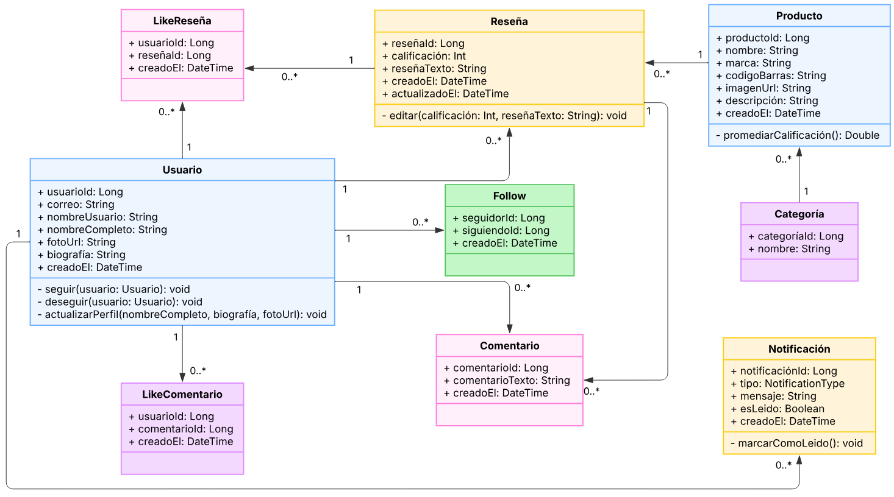
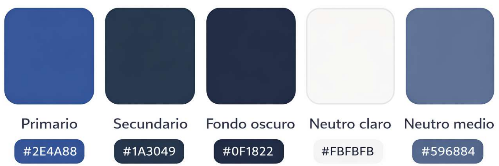

# Buy it

## Objetivo
El objetivo de este proyecto es crear una red social donde se creen reseñas referentes a productos de uso cotidianos, especialmente comestibles y de aseo que puedan ser encontrados en los distintos supermercados comunes.

## Integrantes
[Salomon Avila](https://github.com/SalomonAvila)

[Miguel Angel Garcia](https://github.com/Islunimy)

[Luis Santos](https://github.com/advSNTS)

[Gabriel Jaramillo](https://github.com/GabrielJaramilloCuberos)

## Requerimientos

A continuación se detallan los requisitos funcionales del sistema, divididos por módulos operativos:

<b>Módulo A: Autenticación</b>

* **RF-01 Registro de usuario:** El sistema permitirá registrar un usuario con correo, nombre de usuario y contraseña.
* **RF-02 Validación de registro:** El sistema validará campos obligatorios y que correo/usuario no existan.
* **RF-03 Inicio de sesión:** El sistema permitirá iniciar sesión con correo/usuario y contraseña.
* **RF-04 Cierre de sesión:** El usuario podrá cerrar sesión desde el perfil o configuración.
* **RF-05 Recuperación de contraseña:** El usuario podrá solicitar restablecer contraseña mediante correo.

<b>Módulo B: Perfil y Cuenta</b>

* **RF-06 Ver perfil:** El usuario podrá ver su perfil con foto, usuario y resumen de actividad.
* **RF-07 Editar perfil:** El usuario podrá actualizar su foto y datos básicos.
* **RF-08 Cambiar foto de perfil:** El usuario podrá cargar una imagen desde galería/cámara.
* **RF-09 Eliminar cuenta:** El usuario podrá eliminar su cuenta

<b>Módulo C: Productos</b>

* **RF-10 Listar productos recientes:** El sistema mostrará un listado de productos agregados recientemente, ordenados por fecha de creación.
* **RF-11 Ordenar por popularidad:** El sistema permitirá ordenar los productos según su nivel de popularidad.
* **RF-12 Búsqueda por nombre:** El usuario podrá buscar productos por nombre usando una barra de búsqueda.
* **RF-13 Filtrar por subcategoría:** El usuario podrá filtrar productos por subcategoría.
* **RF-14 Ver detalle del producto:** Al seleccionar un producto, el usuario verá:
  <ul>
    <li>Información básica del producto</li>
    <li>Calificación promedio</li>
    <li>Número total de reseñas</li>
    <li>Reseñas de usuarios</li>
  </ul>

<b>Módulo D: Reseñas y Calificaciones</b>

* **RF-15 Crear reseña:** El usuario podrá crear una reseña sobre un producto, incluyendo:
  <ul>
    <li>Calificación entera.</li>
    <li>Texto de reseña.</li>
  </ul>
* **RF-16 Evitar reseña duplicada:** El sistema impedirá que el usuario cree una segunda reseña del mismo producto.
* **RF-17 Editar reseña:** El usuario podrá editar su reseña existente.
* **RF-18 Eliminar reseña:** El usuario podrá eliminar su reseña, con confirmación.
* **RF-19 Ver reseñas de otros:** En el detalle del producto, el usuario podrá ver reseñas publicadas por otros usuarios.

<b>Módulo E: Interacción Social</b>

* **RF-20 Seguir usuario:** El usuario podrá seguir a otro usuario desde su perfil o desde una reseña.
* **RF-21 Dejar de seguir:** El usuario podrá dejar de seguir usuarios.
* **RF-22 Feed de seguidos:** El usuario visualizará un feed con reseñas de usuarios seguidos ordenadas por fecha.
* **RF-23 Ver perfil de otro usuario:** El usuario podrá ver el perfil público de otros usuarios, incluyendo sus reseñas recientes.

<b>Módulo F: Comentarios</b>

* **RF-24 Comentar reseña:** El usuario podrá comentar una reseña de producto.
* **RF-25 Ver comentarios:** El sistema mostrará la lista de comentarios de una reseña, ordenados por fecha.
* **RF-26 Validación de comentarios:** El sistema impedirá comentarios vacíos.
* **RF-27 Comentarios sin seguimiento:** Se permitirá comentar aunque el usuario no siga al autor.

<b>Módulo G: Notificaciones</b>

* **RF-28 Nuevo seguidor:** El sistema notificará cuando alguien siga al usuario.
* **RF-29 Nuevo comentario:** El sistema notificará cuando comenten una reseña del usuario.
* **RF-30 Notificación por Like:** El sistema notificará cuando alguien dé like a una reseña/comentario.
* **RF-31 Bandeja de notificaciones:** El usuario podrá ver un listado de notificaciones y marcarlas como leídas.

## Diagrama E-R

## Diagrama de clases

## Paleta de colores
